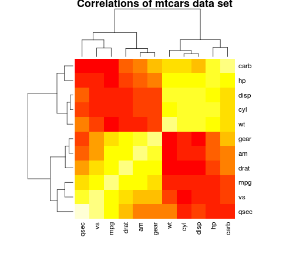

Is an automatic or manual transmission better for MPG
========================================================


Executive summary
=================

Introduction
============
You work for Motor Trend, a magazine about the automobile industry. Looking at a data set of a collection of cars, they are interested in exploring the relationship between a set of variables and miles per gallon (MPG) (outcome). They are particularly interested in the following two questions:

*“Is an automatic or manual transmission better for MPG”*  
*"Quantify the MPG difference between automatic and manual transmissions"*

# Exploration of data

## Summary of mtcars

```r
data<-mtcars
library(xtable)
xt<-xtable(summary(data))
print(xt, type="html")
```

<!-- html table generated in R 3.1.0 by xtable 1.7-3 package -->
<!-- Wed Jul 23 22:39:50 2014 -->
<TABLE border=1>
<TR> <TH>  </TH> <TH>      mpg </TH> <TH>      cyl </TH> <TH>      disp </TH> <TH>       hp </TH> <TH>      drat </TH> <TH>       wt </TH> <TH>      qsec </TH> <TH>       vs </TH> <TH>       am </TH> <TH>      gear </TH> <TH>      carb </TH>  </TR>
  <TR> <TD align="right"> 1 </TD> <TD> Min.   :10.4   </TD> <TD> Min.   :4.00   </TD> <TD> Min.   : 71.1   </TD> <TD> Min.   : 52.0   </TD> <TD> Min.   :2.76   </TD> <TD> Min.   :1.51   </TD> <TD> Min.   :14.5   </TD> <TD> Min.   :0.000   </TD> <TD> Min.   :0.000   </TD> <TD> Min.   :3.00   </TD> <TD> Min.   :1.00   </TD> </TR>
  <TR> <TD align="right"> 2 </TD> <TD> 1st Qu.:15.4   </TD> <TD> 1st Qu.:4.00   </TD> <TD> 1st Qu.:120.8   </TD> <TD> 1st Qu.: 96.5   </TD> <TD> 1st Qu.:3.08   </TD> <TD> 1st Qu.:2.58   </TD> <TD> 1st Qu.:16.9   </TD> <TD> 1st Qu.:0.000   </TD> <TD> 1st Qu.:0.000   </TD> <TD> 1st Qu.:3.00   </TD> <TD> 1st Qu.:2.00   </TD> </TR>
  <TR> <TD align="right"> 3 </TD> <TD> Median :19.2   </TD> <TD> Median :6.00   </TD> <TD> Median :196.3   </TD> <TD> Median :123.0   </TD> <TD> Median :3.69   </TD> <TD> Median :3.33   </TD> <TD> Median :17.7   </TD> <TD> Median :0.000   </TD> <TD> Median :0.000   </TD> <TD> Median :4.00   </TD> <TD> Median :2.00   </TD> </TR>
  <TR> <TD align="right"> 4 </TD> <TD> Mean   :20.1   </TD> <TD> Mean   :6.19   </TD> <TD> Mean   :230.7   </TD> <TD> Mean   :146.7   </TD> <TD> Mean   :3.60   </TD> <TD> Mean   :3.22   </TD> <TD> Mean   :17.8   </TD> <TD> Mean   :0.438   </TD> <TD> Mean   :0.406   </TD> <TD> Mean   :3.69   </TD> <TD> Mean   :2.81   </TD> </TR>
  <TR> <TD align="right"> 5 </TD> <TD> 3rd Qu.:22.8   </TD> <TD> 3rd Qu.:8.00   </TD> <TD> 3rd Qu.:326.0   </TD> <TD> 3rd Qu.:180.0   </TD> <TD> 3rd Qu.:3.92   </TD> <TD> 3rd Qu.:3.61   </TD> <TD> 3rd Qu.:18.9   </TD> <TD> 3rd Qu.:1.000   </TD> <TD> 3rd Qu.:1.000   </TD> <TD> 3rd Qu.:4.00   </TD> <TD> 3rd Qu.:4.00   </TD> </TR>
  <TR> <TD align="right"> 6 </TD> <TD> Max.   :33.9   </TD> <TD> Max.   :8.00   </TD> <TD> Max.   :472.0   </TD> <TD> Max.   :335.0   </TD> <TD> Max.   :4.93   </TD> <TD> Max.   :5.42   </TD> <TD> Max.   :22.9   </TD> <TD> Max.   :1.000   </TD> <TD> Max.   :1.000   </TD> <TD> Max.   :5.00   </TD> <TD> Max.   :8.00   </TD> </TR>
   </TABLE>

## Data cleansing

```r
data$cyl<-factor(data$cyl)
data$am<-factor(data$am)
levels(data$am)<-c("automatic", "manual")
data$gear<-factor(data$gear)
data$carb<-factor(data$carb)
```

## Vizualization

```r
library(ggplot2)
qplot(x=wt, y=mpg, data=data, colour=am, facets=. ~ cyl, main="MPG per cyl, wt, trans type")
```

 

# Linear reg. Model
## Select key metrics
Intuitevely we could say that mpg is dependend on such variables as weight, cylinder count and (testing hypothesis)
on transmission type. To test the hypotesis we should try all of the possible models. To that we can use R function `step`
that we can use for testing multiple models. However there shortcommings of this methods should be know. The following blogpost
describes this problem: http://davegiles.blogspot.com/2014/07/step-wise-regression.html

```r
stepmodel <- step(lm(data=data, mpg ~ .),trace=0,steps=1000, direction="both")
print(stepmodel)
```

```
## 
## Call:
## lm(formula = mpg ~ cyl + hp + wt + am, data = data)
## 
## Coefficients:
## (Intercept)         cyl6         cyl8           hp           wt  
##     33.7083      -3.0313      -2.1637      -0.0321      -2.4968  
##    ammanual  
##      1.8092
```
Clearly there is additional variable that was missed and that is: hp. We can verify this output by checking the correlation
matrix. See appendix for more info. Results of this are shown in appendix, but they confirm all of the assumptions/intuition.

## Use one variable
Let's first try create regression models based one variable (the most significant, and the one that we are interested in)

```r
model1<-lm(mpg~am, data=data)
print(model1)
```

```
## 
## Call:
## lm(formula = mpg ~ am, data = data)
## 
## Coefficients:
## (Intercept)     ammanual  
##       17.15         7.24
```

```r
model2<-lm(mpg~cyl, data=data)
print(model2)
```

```
## 
## Call:
## lm(formula = mpg ~ cyl, data = data)
## 
## Coefficients:
## (Intercept)         cyl6         cyl8  
##       26.66        -6.92       -11.56
```
Those results we can interpret as following that using automatic transmission lowers the mpg you of a car by about 7 mpg (`model1`).
However moving from 4 cylinders to 6 and then to 8 reduces your mpg quite significant value from 26, to 19 to 14.5 mpg (`model2`)


## Use multiple variable lm model
Let's see how adding variables impacts the model.

```r
model3<-lm(mpg~cyl+hp, data=data)
print(model3)
```

```
## 
## Call:
## lm(formula = mpg ~ cyl + hp, data = data)
## 
## Coefficients:
## (Intercept)         cyl6         cyl8           hp  
##      28.650       -5.968       -8.521       -0.024
```

```r
model4<-lm(mpg~cyl+hp+wt, data=data)
print(model4)
```

```
## 
## Call:
## lm(formula = mpg ~ cyl + hp + wt, data = data)
## 
## Coefficients:
## (Intercept)         cyl6         cyl8           hp           wt  
##     35.8460      -3.3590      -3.1859      -0.0231      -3.1814
```

```r
model5<-lm(mpg~cyl+hp+wt+am, data=data)
print(model5)
```

```
## 
## Call:
## lm(formula = mpg ~ cyl + hp + wt + am, data = data)
## 
## Coefficients:
## (Intercept)         cyl6         cyl8           hp           wt  
##     33.7083      -3.0313      -2.1637      -0.0321      -2.4968  
##    ammanual  
##      1.8092
```

## Interpretation


```r
anova(model1, model2, model3, model4, model5)
```

```
## Analysis of Variance Table
## 
## Model 1: mpg ~ am
## Model 2: mpg ~ cyl
## Model 3: mpg ~ cyl + hp
## Model 4: mpg ~ cyl + hp + wt
## Model 5: mpg ~ cyl + hp + wt + am
##   Res.Df RSS Df Sum of Sq     F  Pr(>F)    
## 1     30 721                               
## 2     29 301  1       420 72.24 5.6e-09 ***
## 3     28 277  1        24  4.15 0.05198 .  
## 4     27 161  1       116 20.04 0.00013 ***
## 5     26 151  1        10  1.68 0.20646    
## ---
## Signif. codes:  0 '***' 0.001 '**' 0.01 '*' 0.05 '.' 0.1 ' ' 1
```

# Quality (residuals)
## Results
## Interpretation

# Uncertainty


# Appendix
This heatmap is showing which variables are highly correlated and therefore impact mpg the highest. To get correlation matrix we have to use original mtcars set because we did factorization of some columns, and therefore we cannot use `data` variable. 

```r
heatmap(cor(mtcars), main="Correlations of mtcars data set")
```

 
As it can be seen the transmission type (`am` variable) has very litlle correlation on `mpg`
