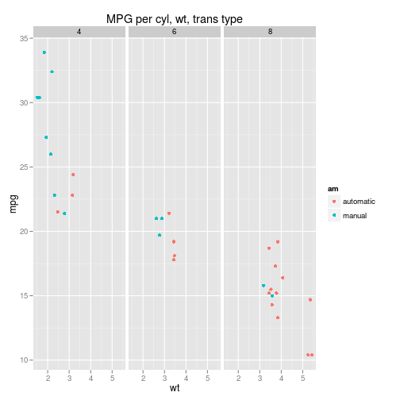
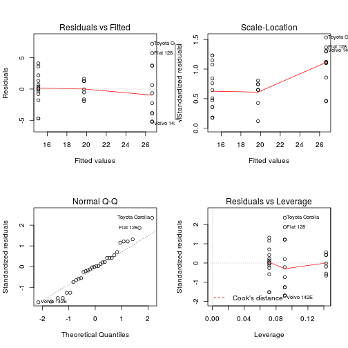
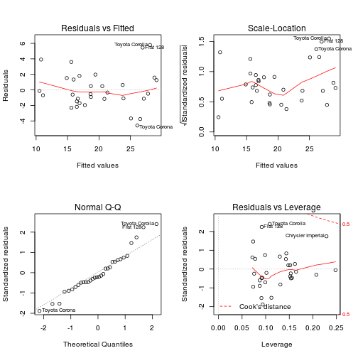
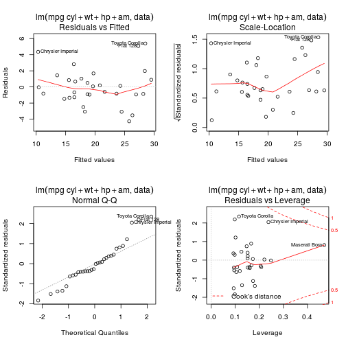
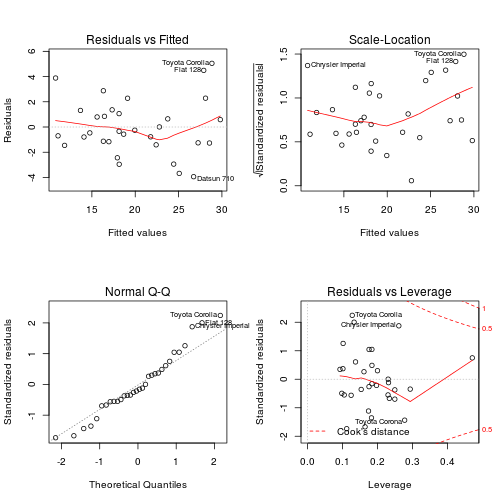

Is an automatic or manual transmission better for MPG
========================================================

## Executive summary

*“Is an automatic or manual transmission better for MPG”*   
*"Quantify the MPG difference between automatic and manual transmissions"*  

Based on the gathered data using simple linear regression model we can conclude that manual gives better MPG by more then 7.24 $\pm$ 4.9.  
After finding the most significant parameters which are (cylinder count, weight, horsepower and transmission type) impact of 
transmission type deacreases to 1.8 $\pm$ 2.41. That is having all other variables the same most cars would show that MPG is better while
having manual transmission.


## Exploration of data

### Summary of mtcars

```r
data<-mtcars
```
The data was extracted from the 1974 Motor Trend US magazine, and comprises fuel consumption and 10 aspects of automobile design and performance for 32 automobiles (1973–74 models).

### Data cleansing

```r
data$cyl<-factor(data$cyl)
data$am<-factor(data$am)
levels(data$am)<-c("automatic", "manual")
data$gear<-factor(data$gear)
data$carb<-factor(data$carb)
```


## Linear reg. Model
### Select key metrics
Intuitevely we could say that mpg is dependend on such variables as weight, cylinder count and (testing hypothesis)
on transmission type. To test the hypotesis we should try all of the possible models. To that we can use R function `step`
that we can use for testing multiple models. However there shortcommings of this methods should be know. The following blogpost
describes this problem: http://davegiles.blogspot.com/2014/07/step-wise-regression.html

```r
stepmodel <- step(lm(data=data, mpg ~ .),trace=0,steps=1000, direction="both")
print(stepmodel$call)
```

```
## lm(formula = mpg ~ cyl + hp + wt + am, data = data)
```
Clearly there is additional variable that was missed and that is: hp. We can verify this output by checking the correlation
matrix. See appendix for more info. Results of this are shown in appendix, but they confirm all of the assumptions/intuition.


Notice that in one of the first steps a factorization of non-continous variables was done, Without factorization a fitted model looks differently:

```r
stepmodel <- step(lm(data=mtcars, mpg ~ .),trace=0,steps=1000, direction="both")
print(stepmodel$call)
```

```
## lm(formula = mpg ~ wt + qsec + am, data = mtcars)
```
This is due the fact that factorization variable is treated (cylinder) as three binary variables and (am) as two binary variables.


### Use one variable
Let's first try create regression models based one variable (the most significant, and the one that we are interested in)

```r
model1<-lm(mpg~am, data=data)
summary(model1)$coef
```

```
##             Estimate Std. Error t value  Pr(>|t|)
## (Intercept)   17.147      1.125  15.247 1.134e-15
## ammanual       7.245      1.764   4.106 2.850e-04
```

```r
model2<-lm(mpg~cyl, data=data)
summary(model2)$coef
```

```
##             Estimate Std. Error t value  Pr(>|t|)
## (Intercept)   26.664     0.9718  27.437 2.688e-22
## cyl6          -6.921     1.5583  -4.441 1.195e-04
## cyl8         -11.564     1.2986  -8.905 8.568e-10
```
Those results we can interpret as following that using automatic transmission lowers the mpg you of a car by about 7 mpg (`model1`).
However moving from 4 cylinders to 6 and then to 8 reduces your mpg quite significant value from 26, to 19 to 14.5 mpg (`model2`)


### Use multiple variable lm model
Let's see how adding variables impacts the model (full summary of models: `model2`, `model3`, `model4` are avaliable in Appendix).

```r
model3<-lm(mpg~cyl+wt, data=data)
model4<-lm(mpg~cyl+wt+hp, data=data)
model5<-lm(mpg~cyl+wt+hp+am, data=data)
```
A multivariate regression coefficient is the expected change in the response per unit change in the regressor, holding all of the other regressors fixed. The combined model has very high probability of 1 - 7.7e-13 for Pr(>|t|).

The adjusted R-squared is a modified version of R-squared that has been adjusted for the number of predictors in the model. The adjusted R-squared increases only if the new term improves the model more than would be expected by chance. It decreases when a predictor improves the model by less than expected by chance. The adjusted R-squared can be negative, but it’s usually not.  It is always lower than the R-squared.

```r
adj.r2<-c(summary(model1)$adj.r.squared,
  summary(model2)$adj.r.squared,
  summary(model3)$adj.r.squared,
  summary(model4)$adj.r.squared,
  summary(model5)$adj.r.squared)
names(adj.r2)<-c("model1", "model2", "model3", "model4", "model5")
print(adj.r2)
```

```
## model1 model2 model3 model4 model5 
## 0.3385 0.7140 0.8200 0.8361 0.8401
```

That we observe the value of adjusted $R^2$ increasing therefore we can conclude that predictor improves.

## Appendix
This heatmap is showing which variables are highly correlated and therefore impact mpg the highest. To get correlation matrix we have to use original mtcars set because we did factorization of some columns, and therefore we cannot use `data` variable. 

```r
heatmap(cor(mtcars), main="Correlations of mtcars data set")
```

 

As it can be seen the transmission type (`am` variable) has very litlle correlation on `mpg`

### Vizualization

```r
library(ggplot2)
qplot(x=wt, y=mpg, data=data, colour=am, facets=. ~ cyl, main="MPG per cyl, wt, trans type")
```

 

### Model 2

```r
summary(model2)
```

```
## 
## Call:
## lm(formula = mpg ~ cyl, data = data)
## 
## Residuals:
##    Min     1Q Median     3Q    Max 
## -5.264 -1.836  0.029  1.389  7.236 
## 
## Coefficients:
##             Estimate Std. Error t value Pr(>|t|)    
## (Intercept)   26.664      0.972   27.44  < 2e-16 ***
## cyl6          -6.921      1.558   -4.44  0.00012 ***
## cyl8         -11.564      1.299   -8.90  8.6e-10 ***
## ---
## Signif. codes:  0 '***' 0.001 '**' 0.01 '*' 0.05 '.' 0.1 ' ' 1
## 
## Residual standard error: 3.22 on 29 degrees of freedom
## Multiple R-squared:  0.732,	Adjusted R-squared:  0.714 
## F-statistic: 39.7 on 2 and 29 DF,  p-value: 4.98e-09
```

```r
layout(matrix(c(1,2,3,4),2,2)) # optional 4 graphs/page 
plot(model2)
```

 

### Model 3

```r
summary(model3)
```

```
## 
## Call:
## lm(formula = mpg ~ cyl + wt, data = data)
## 
## Residuals:
##    Min     1Q Median     3Q    Max 
## -4.589 -1.236 -0.516  1.384  5.792 
## 
## Coefficients:
##             Estimate Std. Error t value Pr(>|t|)    
## (Intercept)   33.991      1.888   18.01  < 2e-16 ***
## cyl6          -4.256      1.386   -3.07  0.00472 ** 
## cyl8          -6.071      1.652   -3.67  0.00100 ***
## wt            -3.206      0.754   -4.25  0.00021 ***
## ---
## Signif. codes:  0 '***' 0.001 '**' 0.01 '*' 0.05 '.' 0.1 ' ' 1
## 
## Residual standard error: 2.56 on 28 degrees of freedom
## Multiple R-squared:  0.837,	Adjusted R-squared:  0.82 
## F-statistic: 48.1 on 3 and 28 DF,  p-value: 3.59e-11
```

```r
layout(matrix(c(1,2,3,4),2,2)) # optional 4 graphs/page 
plot(model3)
```

 

### Model 4

```r
summary(model4)
```

```
## 
## Call:
## lm(formula = mpg ~ cyl + wt + hp, data = data)
## 
## Residuals:
##    Min     1Q Median     3Q    Max 
## -4.261 -1.032 -0.321  0.928  5.395 
## 
## Coefficients:
##             Estimate Std. Error t value Pr(>|t|)    
## (Intercept)  35.8460     2.0410   17.56  2.7e-16 ***
## cyl6         -3.3590     1.4017   -2.40  0.02375 *  
## cyl8         -3.1859     2.1705   -1.47  0.15370    
## wt           -3.1814     0.7196   -4.42  0.00014 ***
## hp           -0.0231     0.0120   -1.93  0.06361 .  
## ---
## Signif. codes:  0 '***' 0.001 '**' 0.01 '*' 0.05 '.' 0.1 ' ' 1
## 
## Residual standard error: 2.44 on 27 degrees of freedom
## Multiple R-squared:  0.857,	Adjusted R-squared:  0.836 
## F-statistic: 40.5 on 4 and 27 DF,  p-value: 4.87e-11
```

```r
layout(matrix(c(1,2,3,4),2,2)) # optional 4 graphs/page 
plot(model4, main=summary(model5)$call)
```

 

### Model 5
Looking at the final model quality 

```r
summary(model5)
```

```
## 
## Call:
## lm(formula = mpg ~ cyl + wt + hp + am, data = data)
## 
## Residuals:
##    Min     1Q Median     3Q    Max 
## -3.939 -1.256 -0.401  1.125  5.051 
## 
## Coefficients:
##             Estimate Std. Error t value Pr(>|t|)    
## (Intercept)  33.7083     2.6049   12.94  7.7e-13 ***
## cyl6         -3.0313     1.4073   -2.15   0.0407 *  
## cyl8         -2.1637     2.2843   -0.95   0.3523    
## wt           -2.4968     0.8856   -2.82   0.0091 ** 
## hp           -0.0321     0.0137   -2.35   0.0269 *  
## ammanual      1.8092     1.3963    1.30   0.2065    
## ---
## Signif. codes:  0 '***' 0.001 '**' 0.01 '*' 0.05 '.' 0.1 ' ' 1
## 
## Residual standard error: 2.41 on 26 degrees of freedom
## Multiple R-squared:  0.866,	Adjusted R-squared:  0.84 
## F-statistic: 33.6 on 5 and 26 DF,  p-value: 1.51e-10
```

```r
layout(matrix(c(1,2,3,4),2,2)) # optional 4 graphs/page 
plot(model5)
```

 
